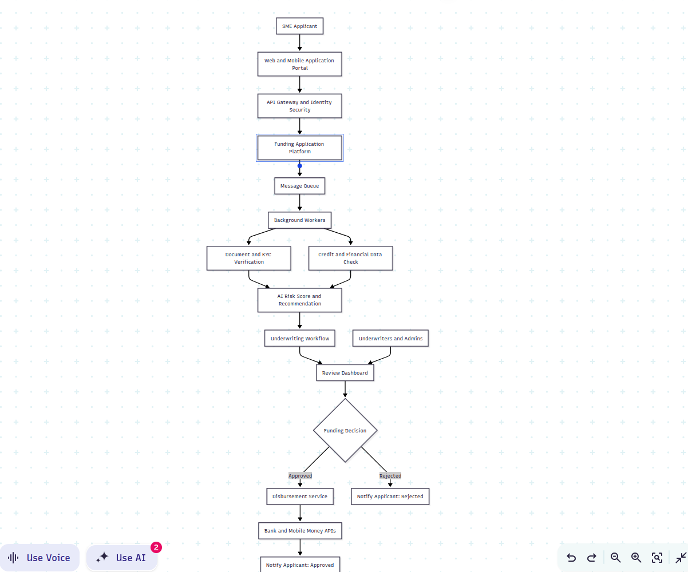
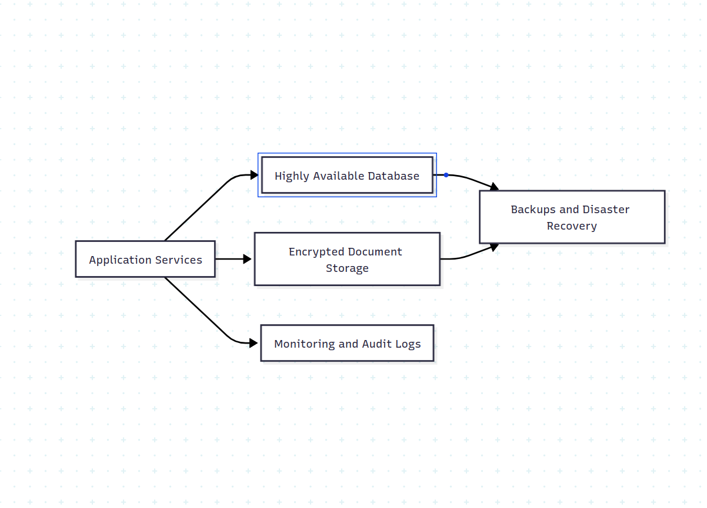

### Scalable and Resilient SME Funding System Architecture

## Overview

This document presents a simple high-level architecture for Vula's funding applications that expects 10x increase in SME funding applications. The current system is a monolith and everything is bundled creating performance bottlenecks.

The system is designed to:

- **Accept applications quickly during periods of high traffic.**

- **Process document, KYC and credit checks asynchronously.**

- **Support AI-assisted risk assessment and human underwriting.**

- **Prevent duplicate decisions and disbursements.**

- **Remain available when individual services fail.**

- **Protect sensitive applicant and financial information.**

## End-to-End Application Flow

## How an Application Moves Through the System

**1.Application submission** -
The SME creates an account, completes the funding form and uploads the required documents through the web or a mobile app.

**2.Secure request handling** -
The API Gateway authenticates the applicant, applies rate limits and routes the request to the funding platform.

**3.Application registration** -
The platform validates the basic information, stores the application and returns a reference number there an then.

**4.Asynchronous processing** -
The application is placed in a message queue. Background workers take applications from the queue without slowing down new submissions.

**5.Verification and financial checks** -
Document and KYC verification runs alongside credit and financial-data checks.

**6.Risk assessment** -
The AI risk service uses the verified information to produce a risk score, risk indicators and a recommendation. It does not make the final funding decision.

**7.Human underwriting** -
Underwriters review the application, supporting documents, verification results and risk recommendation through the review dashboard.

**8.Funding decision** -
An authorized underwriter approves, rejects or requests additional information. Every action is recorded in the audit log.

**9.Disbursement** -
Approved applications are sent to the disbursement service, which transfers funds through a bank or mobile-money provider.

**10.Applicant notification** -
The applicant receives an email, SMS or WhatsApp message confirming the outcome and next steps.

## Core Components

| Component | Responsibility
|---|---|
| Web and Mobile Portal | Application submission, document uploads and status tracking.
| API Gateway and Identity Security |  Authentication, authorization, rate limiting and request routing.
| Funding Application Platform  | Manages applications, application statuses and business rules.
| Message Queue  |  Buffers processing work during traffic spikes and supports safe retries.
| Background Workers | Perform long-running checks independently from application submission.
| Document and KYC Verification |  Validates identity and business documents and performs compliance checks.
| Credit and Financial Data Check |  Collects and evaluates credit history and relevant financial information.
| AI Risk Service | Produces an explainable risk score and recommendation for underwriters.
| Underwriting Workflow |  Controls review assignments, requests for information and approvals.
| Review Dashboard | Gives underwriters one place to review and decide on applications.
| Disbursement Service | Initiates approved payments and prevents duplicate disbursements.
| Notification Service | Sends application updates through email, SMS or WhatsApp.

## Data and Resilience

## Scalability

- **Application services and background workers remain stateless and can scale horizontally.**

- **The message queue absorbs traffic spikes and prevents downstream services from being overloaded.**

- **Workers scale independently according to queue depth.**

- **Frequently requested, non-sensitive reference data can be cached.**

- **Read replicas can support dashboards and reporting without overloading the primary database.**

## Important Design Rule

The platform should acknowledge and save an application quickly. Document processing, KYC verification, credit checks, risk scoring and notifications should run asynchronously through the queue. This keeps application submission responsive even when thousands of SMEs apply at the same time.

## Engineering process to improve  team velocity

***Weekly backlog refinement with clear  acceptance criteria***
Review upcoming work before sprint planning and break large tasks into smaller tasks.

***Risk based code reviews with automated quality checks***
Keep pull requests small and use automated linting, test and type checks

***Frequent, low risk releases***
Use feature flags, automated deployments, and staged rollouts. Release smaller changes more often, monitor key metrics, and maintain easy rollbacks

***Sprint restrospectives***
After a sprint is done, analyze want went wrong, what went well and how the teams can improve.

