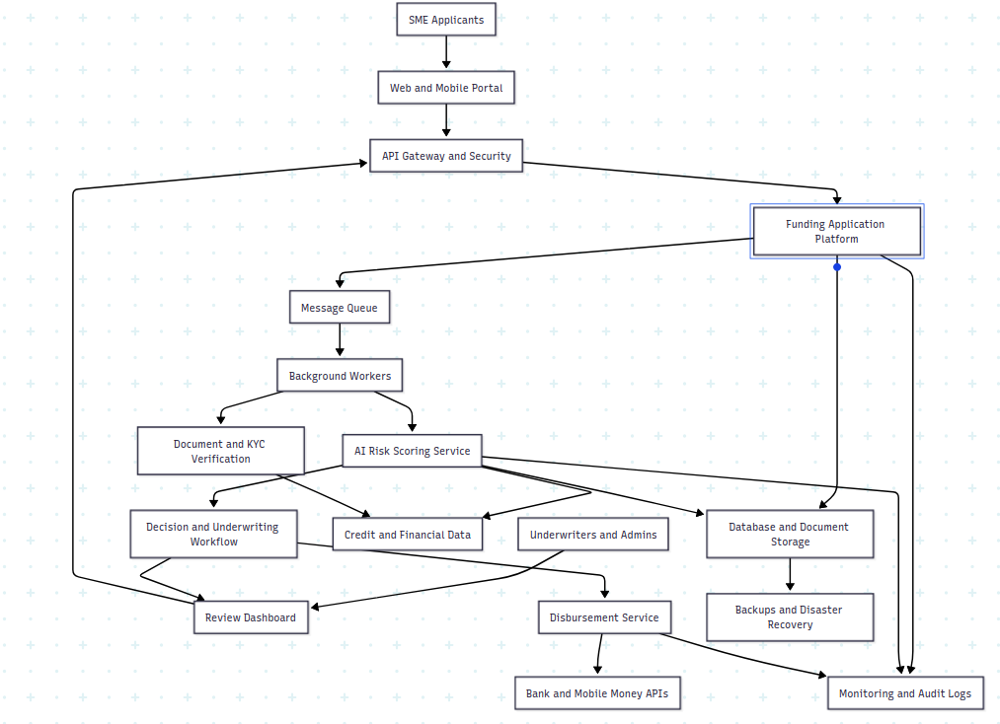

### Scalable and Resilient SME Funding System Architecture

## Overview

This document presents a simple high-level architecture for Vula's funding applications that expects 10x increase in SME funding applications.
The design covers the entire architecture of the funding system from: application , security, async processing and AI-driven risk scoring.
The current system is a monolith and everything is bundled creating performance bottlenecks.

## Proposed Approach
Resource-intensive and high risk-risk workloads are moved out of the synchoronous path keeping the existing service as the main application application.

- **AI risk scoring is set as an independent service**
- **Disbursements as a seperate service with indempotency implemented**
- **introduce queues to async workload processing**

## Architecture Diagram 

